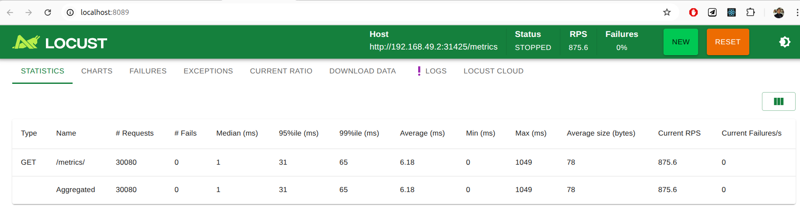
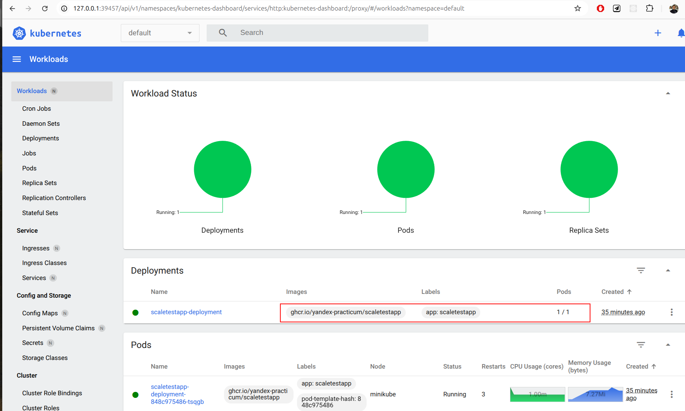
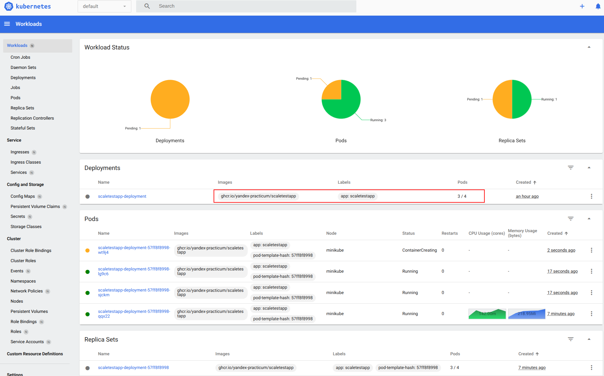
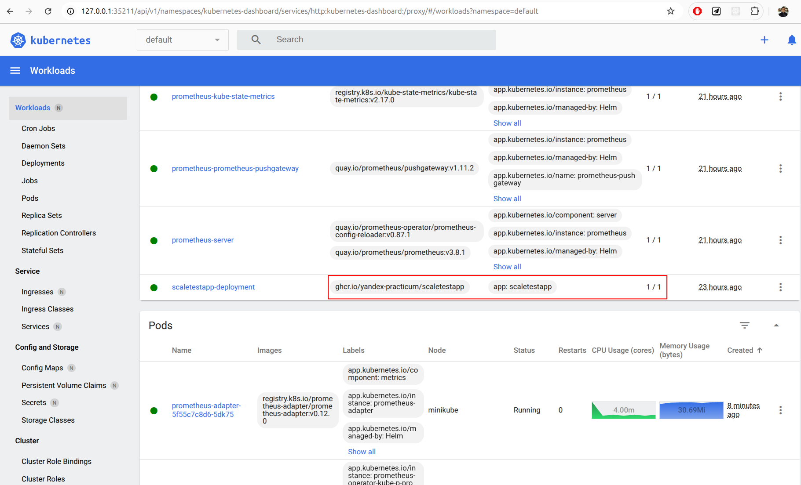
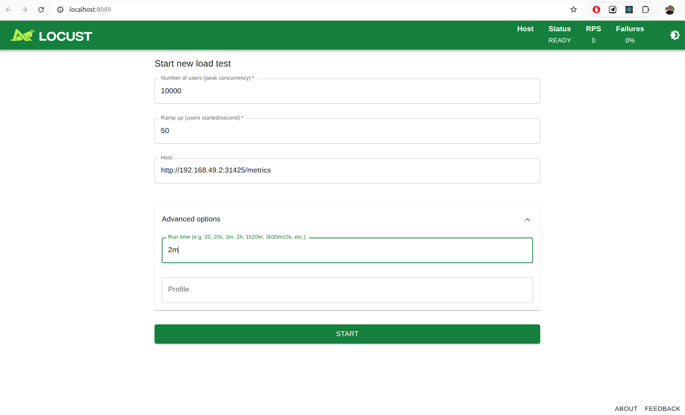
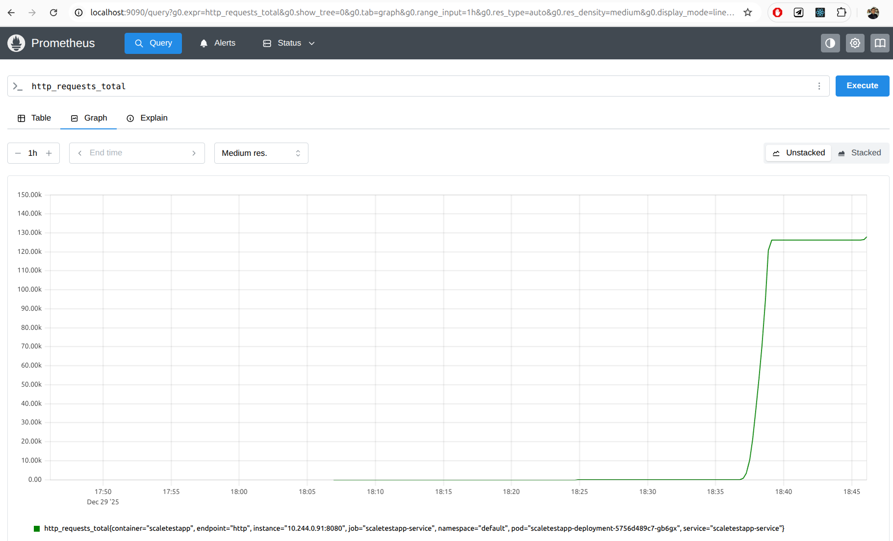
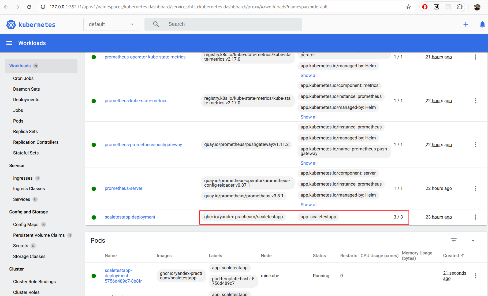

# Часть 1: HPA
## Запуск Locust

## До нагрузки

## Масштабирование под нагрузкой

# Часть 2: Динамическая маршрутизация

## До нагрузки

## Запуск Locust

## Prometheus

## Масштабирование под нагрузкой

## Установка и настройка Prometheus

    helm repo add prometheus-community https://prometheus-community.github.io/helm-charts
    helm repo update
    helm install prometheus prometheus-community/prometheus
    helm install prometheus-operator prometheus-community/kube-prometheus-stack
    helm install prometheus-adapter oci://ghcr.io/prometheus-community/charts/prometheus-adapter
    kubectl apply -f servicemonitor.yaml # apply all config files
    ....
    kubectl delete pod prometheus-prometheus-operator-kube-p-prometheus-0  # prometheus restart
    kubectl port-forward svc/prometheus-server 9090:80
    kubectl port-forward service/prometheus-operator-kube-p-prometheus 9090:9090

